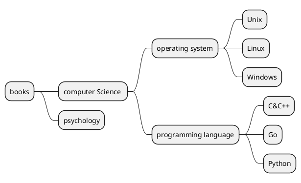

层级目录是很常见的展示分类数据的方式，但是在关系型数据库(例如 MySQL )中存储并不能很好的处理这种层级很多父子关系。

- 当层数固定且较少（2-3层）时，可以使用一对多关系表来表示数据之间的关系；  
- 当层数较多，或者不固定，可随意增减时，关系表就不适用了，我们不可能在需要创建下级的时候新建一张表，这样数据库管理就很麻烦了。

一个常见的书籍分类如下图所示：



以上面书籍分类为例，我们基于 `MySQL-5.7` 分别介绍两种不同的层级数据存储模型：

## 邻接列表模型

邻接表模型是较为传统方式，以 id 和 parent_id 形成自关联关系，将数据存储在一张表中，省去了多张关系表的麻烦，变得简洁明了。

### 初始化数据

先创建一张 `catalog` 表

```sql
CREATE TABLE `catalog` (
  `id` int(11) unsigned NOT NULL AUTO_INCREMENT,
  `name` varchar(255) DEFAULT NULL,
  `parent_id` int(11) DEFAULT NULL,
  PRIMARY KEY (`id`)
) ENGINE=InnoDB DEFAULT CHARSET=utf8mb4;
```

按上面图形的关系插入数据，以 `id` 和 `parent_id` 表示父子关系，最顶层父节点 `id` 为 0，这种父子关系可以很直观的理解。

```sql
mysql> INSERT INTO `catalog` VALUES (1, 'books', 0);
mysql> INSERT INTO `catalog` VALUES (2, 'computer Science', 1);
mysql> INSERT INTO `catalog` VALUES (3, 'operating system', 2);
mysql> INSERT INTO `catalog` VALUES (4, 'Unix', 3);
mysql> INSERT INTO `catalog` VALUES (5, 'Linux', 3);
mysql> INSERT INTO `catalog` VALUES (6, 'Windows', 3);
mysql> INSERT INTO `catalog` VALUES (7, 'programming language', 2);
mysql> INSERT INTO `catalog` VALUES (8, 'C&C++', 7);
mysql> INSERT INTO `catalog` VALUES (9, 'Go', 7);
mysql> INSERT INTO `catalog` VALUES (10, 'Python', 7);
mysql> INSERT INTO `catalog` VALUES (11, 'psychology', 1);
```

查询结果如下：

```sql
mysql> select * from catalog;
+----+----------------------+-----------+
| id | name                 | parent_id |
+----+----------------------+-----------+
|  1 | books                |         0 |
|  2 | computer Science     |         1 |
|  3 | operating system     |         2 |
|  4 | Unix                 |         3 |
|  5 | Linux                |         3 |
|  6 | Windows              |         3 |
|  7 | programming language |         2 |
|  8 | C&C++                |         7 |
|  9 | Go                   |         7 |
| 10 | Python               |         7 |
| 11 | psychology           |         1 |
+----+----------------------+-----------+
11 rows in set (0.00 sec)

```

虽然看起来很直观，而且当我们插入新数据时，可以很容易的根据父节点 id 插入对应的数据，但是删除某一结点的时候，需要先删除该节点的所有子孙节点，才能删除该节点，否则子节点会成为孤儿节点存在，消失在树中。而且查询整个树时，由于不知道具体层数，则需要递归查询所有子节点，以确保所有节点被找到，时间复杂度极高，数据量不大的情况下我们可以使用 MySQL 函数进行查询子节点工作，简单方便。

递归的方法可以参考：[MySQL中进行树状所有子节点的查询](https://blog.csdn.net/acmain_chm/article/details/4142971)这篇文章的内容，这里不多做解释。

### 查询子节点函数

```sql
CREATE DEFINER=`root`@`%` FUNCTION `getChildList`(rootId int) RETURNS varchar(1000) CHARSET utf8mb4
    DETERMINISTIC
BEGIN
    DECLARE sTemp VARCHAR (1000) ;
    DECLARE sTempChd VARCHAR(1000);
    SET sTemp = ''; 
    SET sTempChd =CAST(rootId AS CHAR); 
    WHILE sTempChd IS NOT NULL DO 
        -- 拼接 ',' 为了和  GROUP_CONCAT 函数保持一致
        SET sTemp = CONCAT(sTemp,sTempChd,',');
        SELECT GROUP_CONCAT(id) INTO sTempChd FROM `catalog` WHERE FIND_IN_SET(`parent_id`, sTempChd) > 0; 
    END WHILE; 
    SET sTemp = CONCAT(sTemp,'-1');
    RETURN sTemp;
END
```

该函数中，使用 `GROUP_CONCAT` 函数能够组合父节点 id 相同的子 id，并默认以 `,` 分隔，但其返回结果的长度受参数 `group_concat_max_len` 控制，默认值为1024，若需要修改，则修改 `MySQL` 配置文件的参数即可，或者执行下面的 sql 语句修改：

```sql
 SET GLOBAL group_concat_max_len = 10240;
```

### 查询子树

MySQL 的函数能和 `WHERE` 关键词一起在 sql 语句中使用:

```sql
-- 查询整个树的节点id;
mysql> select getChildList(1);
+----------------------------+
| getChildList(1)            |
+----------------------------+
| 1,2,11,3,7,4,5,6,8,9,10,-1 |
+----------------------------+
1 row in set (0.00 sec)

-- 查询子树信息；
mysql> select * from catalog where FIND_IN_SET(id, getChildList(3));
+----+------------------+-----------+
| id | name             | parent_id |
+----+------------------+-----------+
|  3 | operating system |         2 |
|  4 | Unix             |         3 |
|  5 | Linux            |         3 |
|  6 | Windows          |         3 |
+----+------------------+-----------+
4 rows in set (0.00 sec)
```

### 删除子树

使用查询子节点函数也可以删除整个子树，而且不会产生孤儿节点。

```sql
mysql> delete from catalog where FIND_IN_SET(id, getChildList(3));
Query OK, 4 rows affected (0.02 sec)

mysql> select * from catalog;
+----+----------------------+-----------+
| id | name                 | parent_id |
+----+----------------------+-----------+
|  1 | books                |         0 |
|  2 | computer Science     |         1 |
|  7 | programming language |         2 |
|  8 | C&C++                |         7 |
|  9 | Go                   |         7 |
| 10 | Python               |         7 |
| 11 | psychology           |         1 |
+----+----------------------+-----------+
7 rows in set (0.00 sec)

```

## 嵌套集合模型

嵌套集模型是多个嵌套在一起的集合来表示数据之间的层级关系，每个数据都有自己的 `left` 和 `right`值，以此来表示集合的边界


### 初始化集合数据

新建一张带左右值的表，第一条数据，也就是根节点的左右值为 1 和 2，每次插入子节点时都需要更新该子节点右边的左右值

```sql
DROP TABLE IF EXISTS `nested_category`;
CREATE TABLE `nested_category`  (
  `id` int(11) NOT NULL AUTO_INCREMENT,
  `name` varchar(255) CHARACTER SET utf8mb4 COLLATE utf8mb4_general_ci NULL DEFAULT NULL,
  `lft` int(11) NULL DEFAULT NULL,
  `rgt` int(11) NULL DEFAULT NULL,
  PRIMARY KEY (`id`) USING BTREE
) ENGINE = InnoDB AUTO_INCREMENT = 1 CHARACTER SET = utf8mb4 COLLATE = utf8mb4_general_ci ROW_FORMAT = Dynamic;
```

插入预定义的数据：

```sql
INSERT INTO `nested_category` VALUES (1, 'books', 1, 22);
INSERT INTO `nested_category` VALUES (2, 'computer Science', 2, 19);
INSERT INTO `nested_category` VALUES (3, 'operating system', 3, 10);
INSERT INTO `nested_category` VALUES (4, 'Unix', 4, 5);
INSERT INTO `nested_category` VALUES (5, 'Linux', 6, 7);
INSERT INTO `nested_category` VALUES (6, 'Windows', 8, 9);
INSERT INTO `nested_category` VALUES (7, 'programming language', 11, 18);
INSERT INTO `nested_category` VALUES (8, 'C&C++', 12, 13);
INSERT INTO `nested_category` VALUES (9, 'Go', 14, 15);
INSERT INTO `nested_category` VALUES (10, 'Python', 16, 17);
INSERT INTO `nested_category` VALUES (11, 'psychology', 20, 21);
```

这些左右值数据水平展开来看就如下图编号所示，从左到右，依次增大，这种左右值的访问顺序与二叉树的先序遍历类似


### 查询完整树列表

在嵌套集模型中，查询相对来说就方便很多，只需要依据根节点 `lft` 和 `rgt` 就可以判断子树的范围，子节点的 `lft` 或 `rgt` 值一定在父节点 `lft` 和 `rgt` 值之间

```sql
-- 查询完整树
mysql> SELECT node.name, node.lft, node.rgt
    -> FROM nested_category AS node,
    ->      nested_category AS parent
    -> WHERE node.lft BETWEEN parent.lft AND parent.rgt AND parent.id = 1
    -> ORDER BY node.lft;
+----------------------+------+------+
| name                 | lft  | rgt  |
+----------------------+------+------+
| books                |    1 |   22 |
| computer Science     |    2 |   19 |
| operating system     |    3 |   10 |
| Unix                 |    4 |    5 |
| Linux                |    6 |    7 |
| Windows              |    8 |    9 |
| programming language |   11 |   18 |
| C&C++                |   12 |   13 |
| Go                   |   14 |   15 |
| Python               |   16 |   17 |
| psychology           |   20 |   21 |
+----------------------+------+------+
11 rows in set (0.00 sec)

-- 查询 operating system 子树列表
mysql> SELECT node.name
    -> FROM nested_category AS node,
    ->      nested_category AS parent
    -> WHERE node.lft BETWEEN parent.lft AND parent.rgt AND parent.id = 3
    -> ORDER BY node.lft;
+------------------+
| name             |
+------------------+
| operating system |
| Unix             |
| Linux            |
| Windows          |
+------------------+
4 rows in set (0.00 sec)
```

这样一来就不用关心层级有多少层，也不用递归遍历子节点，查询就方便很多，也能提高响应效率。

### 插入新节点

通过创建存储过程实现插入新节点的流程，然而存储过程的实现并不是原子操作，中间发生失败，不会回退，这里只是用作演示，实际应用最好在存储过程里添加事务，或是直接在业务代码中采用事务的方式进行操作

创建添加新节点的存储过程，该过程添加的新节点默认插入指定父节点的所有子节点的末尾位置：

```sql
CREATE DEFINER=`root`@`%` PROCEDURE `addNode`( IN `father` int, IN `name` varchar(255))
BEGIN
    -- 获取父节点 right 值
    SELECT @frgt := rgt FROM nested_category WHERE id = @father;
    -- 更新父节点 right 值右边的左右边界都 +2
    UPDATE nested_category SET rgt = rgt + 2 WHERE rgt > @frgt - 1;
    UPDATE nested_category SET lft = lft + 2 WHERE lft > @frgt - 1;
    -- 插入新数据
    INSERT INTO nested_category(name, lft, rgt) VALUES(@name, @frgt, @frgt + 1);

END
```

插入数据验证：

```sql
mysql> set @father := 11;
Query OK, 0 rows affected (0.00 sec)

mysql> set @name := 'Cognitive psychology';
Query OK, 0 rows affected (0.00 sec)

mysql> call addNode(@father, @name);
+--------------+
| @frgt := rgt |
+--------------+
|           23 |
+--------------+
1 row in set (0.01 sec)

Query OK, 1 row affected (0.02 sec)
```

查询树列表，使用 `count`函数计算深度信息如下，新节点确实位于 `psychology` 节点下方，深度为 2

```sql
mysql> SELECT node.name, (COUNT(parent.name) - 1) AS depth
    -> FROM nested_category AS node,
    ->      nested_category AS parent
    -> WHERE node.lft BETWEEN parent.lft AND parent.rgt 
    -> GROUP BY node.name
    -> ORDER BY node.lft;
+----------------------+-------+
| name                 | depth |
+----------------------+-------+
| books                |     0 |
| computer Science     |     1 |
| operating system     |     2 |
| Unix                 |     3 |
| Linux                |     3 |
| Windows              |     3 |
| programming language |     2 |
| C&C++                |     3 |
| Go                   |     3 |
| Python               |     3 |
| psychology           |     1 |
| Positive psychology  |     2 |
| Cognitive psychology |     2 |
+----------------------+-------+
13 rows in set (0.01 sec)

```

### 删除子树所有节点

删除和添加节点类似，相当于是插入的反向操作，删除节点右边剩余节点的 `lft` 和 `rgt` 值都减去子树的宽度，同样，我们用存储过程实现这一操作：

```sql
CREATE DEFINER=`root`@`%` PROCEDURE `deleteNode`(IN `fid` int)
BEGIN
    -- 查询删除节点的左右值以及宽度
    SELECT @myLeft := lft, @myRight := rgt, @myWidth := rgt - lft + 1
    FROM nested_category WHERE id = @fid;

    DELETE FROM nested_category WHERE lft BETWEEN @myLeft AND @myRight;

    UPDATE nested_category SET rgt = rgt - @myWidth WHERE rgt > @myRight;
    UPDATE nested_category SET lft = lft - @myWidth WHERE lft > @myRight;

END
```

执行存储过程，删除 `programming language` 节点，然后查询结果如下，使用 `CONCAT` 函数将深度转化为缩进，可以看出层级结构依然和之前一样：

```sql
mysql> SELECT CONCAT( REPEAT( ' ', (COUNT(parent.name) - 1) ), node.name) AS name, node.lft, node.rgt
    -> FROM nested_category AS node, nested_category AS parent
    -> WHERE node.lft BETWEEN parent.lft AND parent.rgt
    -> GROUP BY node.name
    -> ORDER BY node.lft;
+------------------------+------+------+
| name                   | lft  | rgt  |
+------------------------+------+------+
| books                  |    1 |   18 |
|  computer Science      |    2 |   11 |
|   operating system     |    3 |   10 |
|    Unix                |    4 |    5 |
|    Linux               |    6 |    7 |
|    Windows             |    8 |    9 |
|  psychology            |   12 |   17 |
|   Positive psychology  |   13 |   14 |
|   Cognitive psychology |   15 |   16 |
+------------------------+------+------+
9 rows in set (0.00 sec)

```

## 总结

总之，两种方法各有利弊，邻接表方便插入，适用于新增层级比较频繁的场景，但是查询效率低下；而嵌套集模型，插入删除需要更新大部分条目，甚至全表更新，但是查询简单直接，对于层级结构相对固定的场景，使用起来相得益彰。所以该使用什么模型，应根据实际需求来定。

## 参考文章

- [MySQL中进行树状所有子节点的查询](https://blog.csdn.net/acmain_chm/article/details/4142971)
- [[译] 在 MySQL 中管理层级数据 —— 两种方法介绍](https://juejin.cn/post/6844903886440890381#heading-5)
- [Managing Hierarchical Data in MySQL](http://mikehillyer.com/articles/managing-hierarchical-data-in-mysql/)